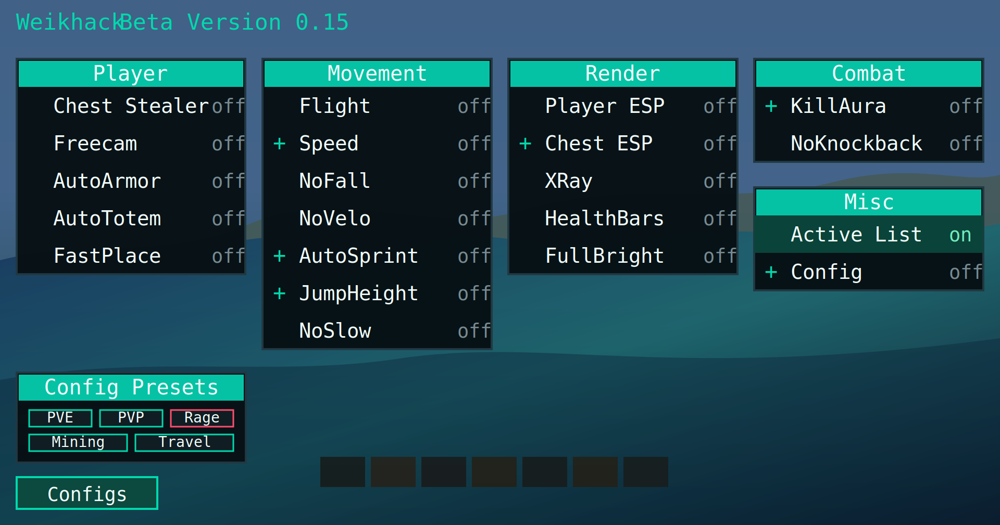

# Weikhack Beta Version 0.15

Weikhack Beta Version 0.15 ist ein externer Fabric Client-Mod für Minecraft 1.21.11. Der Mod wird einfach als normale `.jar` in den Minecraft `mods`-Ordner gelegt und kann dadurch zusammen mit anderen Fabric-Mods genutzt werden, zum Beispiel Cinematica oder weiteren Client-Erweiterungen.



## Features

- Modernes Drag-and-drop ClickGUI über `Right Shift`, inklusive eigenem Config-Panel
- Movement-Module wie Flight, Speed, NoFall, NoVelo, AutoSprint, JumpHeight und NoSlowdown
- Render-Module wie Player ESP, Storage/Chest ESP, XRay, HealthBars und FullBright
- Combat-Module wie NoKnockback und KillAura für Mobs und optional Spieler
- Player-Module wie Chest Stealer, Freecam, AutoArmor, AutoTotem und FastPlace
- Chat-Befehle wie `.help`, `.bind`, `.unbind`, `.clearbinds`, `.saveconfig` und `.speed`
- Eigene Binds können jederzeit frei erstellt werden, zum Beispiel mit `.bind flight g`
- Config-Presets für PVE, PVP, Rage, Mining und Travel, jeweils mit FullBright als Basis
- Config-Speicherknopf inklusive Module, Optionen und Binds
- Reset setzt Module und Binds auf Standard zurück
- Standardmäßig ist nur die Active HUD List eingeschaltet, alle anderen Module und Zieloptionen sind aus

## Installation

1. Fabric Loader für Minecraft 1.21.11 installieren.
2. Die aktuelle `weikhack-beta-version-0.15.jar` aus den Releases, aus dem Ordner `releases/` oder aus GitHub Actions herunterladen.
3. Die Jar in den Minecraft `mods`-Ordner legen.
4. Minecraft mit dem Fabric-Profil starten.

Fabric API wird aktuell nicht als Pflicht-Abhängigkeit benötigt.

## Download

Die öffentliche Version liegt hier im Repository. Unter `Actions` baut der Workflow bei jedem Upload automatisch die aktuelle Jar und stellt sie als Artefakt `weikhack-beta-version-latest` bereit. Zusätzlich liegt die veröffentlichte Jar im Ordner `releases/`.

## Kompatibilität

Weikhack ist als externer Fabric-Mod gedacht. Dadurch kann er parallel zu Cinematica und anderen Fabric-Mods genutzt werden, solange diese ebenfalls zur Minecraft-Version 1.21.11 passen und keine direkten Konflikte mit denselben Minecraft-Klassen verursachen.

## Binds

Es gibt keine festen Tastenvorgaben mehr. Du kannst eigene Binds im Chat erstellen:

```text
.bind <modul> <taste>
```

Beispiele:

```text
.bind flight g
.bind nofall h
.bind fullbright b
```

Mit `.bind list` siehst du aktive Binds. Mit `.clearbinds` löschst du alle Binds.

## Build

Lokal im Projekt:

```powershell
.\.gradle-local\gradle-9.2.1\bin\gradle.bat clean build
```

Auf GitHub nutzt der Workflow:

```bash
gradle clean build
```

Die fertige Jar liegt danach in:

```text
build/libs/
```

## Creator

Erstellt von Weik.

Verbesserungsvorschläge, Ideen und Bug-Reports sind ausdrücklich willkommen. Bitte schreib dazu möglichst genau, welche Minecraft-Version du nutzt, welche weiteren Mods aktiv sind und was im Spiel passiert ist.
